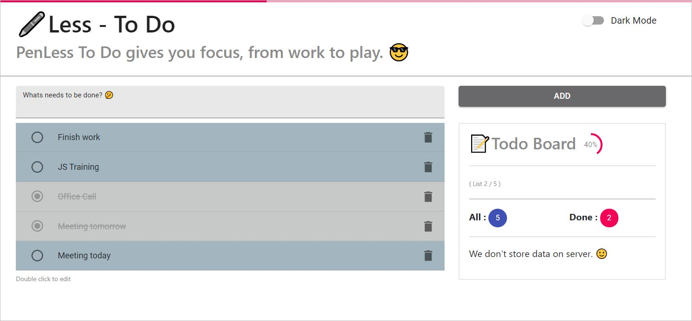
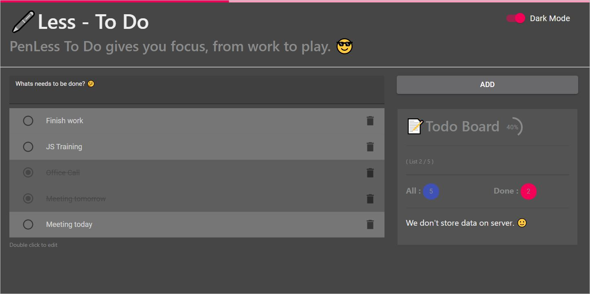

# PainLess To-Do

 

<h2>PenLess To Do gives you focus, from work to play. 😎 </h2>
 

**Landing View**

 
 

**Dark Mode**

 

    <h2> Features </h2>

    - Add Todo
    - Mark as completed
    - Update Todo
    - Delete Todo
    - Todo will be store in the browser
    - Quick board about todo status

 

## Contributing

Create an [issue](https://github.com/hidaytrahman/penless-todo/issues/new) if you find a bug or have a suggestion or question.

If you want to develop this project:

- Fork it!
- Create your feature branch: git checkout -b my-new-feature
- Commit your changes: git commit -am 'Add some feature'
- Push to the branch: git push origin my-new-feature
- Submit a pull request

### Give a Star! ⭐️

If you find this repository useful, please give it a star. Thanks!
